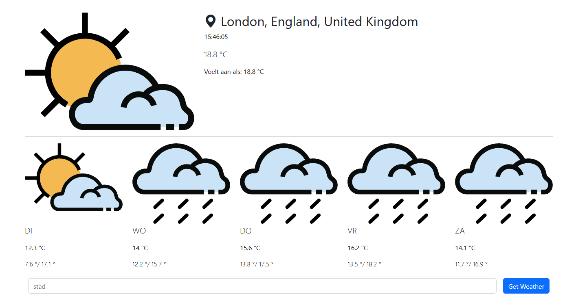

# Oefening 2

Maak met behulp van een weatherAPI een weer widget. Deze widget bevat het huidige weer en een voorspelling voor de komende 5 dagen. De html code krijg je gegeven.

Hiervoor kan je gebruik maken van de gratis weer api van [visual crossin](https://www.visualcrossing.com/). Maak op deze website een key zodat je de api kan gebruiken.
Op deze [pagina](https://www.visualcrossing.com/weather/weather-data-services/brussel?v=api) kan je zien hoe de call is opgemaakt en kan je deze testen.

De applicatie onthoud de laatst gekozen locatie in de localstorage. Wanneer de gebruiker een ongekende locatie kiest, komt er een melding op het scherm die laat weten dat de locatie ongeldig is.
